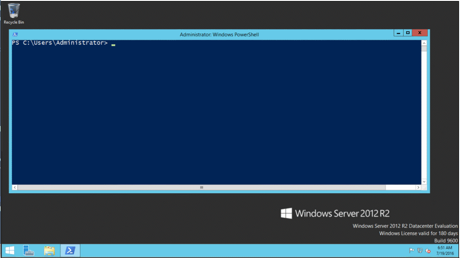

# Issue with PMPR (issue27)

## Output running  the config:


## My config Details

```powershell
PS C:\Users\Administrator> $PSVersionTable

Name                           Value
----                           -----
PSVersion                      5.0.10586.117
PSCompatibleVersions           {1.0, 2.0, 3.0, 4.0...}
BuildVersion                   10.0.10586.117
CLRVersion                     4.0.30319.34209
WSManStackVersion              3.0
PSRemotingProtocolVersion      2.3
SerializationVersion           1.1.0.1

PS C:\Users\Administrator> gwmi win32_operatingsystem


SystemDirectory : C:\Windows\system32
Organization    :
BuildNumber     : 9600
RegisteredUser  : Windows User
SerialNumber    : 00252-90000-00000-AA632
Version         : 6.3.9600
```


Here's the output I get:

```
VERBOSE: [WIN-6DJ0UDMP803]: LCM:  [ Start  Set      ]  [[PackageManagementSource]PSGallery]
WARNING: [WIN-6DJ0UDMP803]:                            [[PackageManagementSource]PSGallery] Begin registering
'PSGallery' to source location 'https://www.powershellgallery.com/api/v2/' with 'Trusted' policy"
VERBOSE: [WIN-6DJ0UDMP803]:                            [[PackageManagementSource]PSGallery] Begin invoking
Register-Packagesource PSGallery
VERBOSE: [WIN-6DJ0UDMP803]:                            [[PackageManagementSource]PSGallery] Repository
details, Name = 'PSGallery', Location = 'https://www.powershellgallery.com/api/v2/'; IsTrusted = 'False';
IsRegistered = 'True'.
WARNING: [WIN-6DJ0UDMP803]:                            [[PackageManagementSource]PSGallery] The specified
repository 'PSGallery' cannot be unregistered.
Cannot bind argument to parameter 'Location' because it is an empty string.
    + CategoryInfo          : InvalidData: (Microsoft.Power...erPackageSource:) [], CimException
    + FullyQualifiedErrorId : ParameterArgumentValidationErrorEmptyStringNotAllowed,Resolve-Location,Microsoft.PowerSh
   ell.PackageManagement.Cmdlets.RegisterPackageSource
    + PSComputerName        : localhost

VERBOSE: [WIN-6DJ0UDMP803]: LCM:  [ End    Set      ]  [[PackageManagementSource]PSGallery]  in 2.2650
seconds.
PowerShell DSC resource MSFT_PackageManagementSource  failed to execute Set-TargetResource functionality with error
message: Failed to register the package source PSGallery. Message:System.Exception: Cannot bind argument to parameter
'Location' because it is an empty string.
    + CategoryInfo          : InvalidOperation: (:) [], CimException
    + FullyQualifiedErrorId : ProviderOperationExecutionFailure
    + PSComputerName        : localhost

VERBOSE: [WIN-6DJ0UDMP803]:                            [] Consistency check completed.
The SendConfigurationApply function did not succeed. LCM failed to start desired state configuration manually.
    + CategoryInfo          : NotSpecified: (root/Microsoft/...gurationManager:String) [], CimException
    + FullyQualifiedErrorId : MI RESULT 1
    + PSComputerName        : localhost

VERBOSE: Operation 'Invoke CimMethod' complete.
VERBOSE: Time taken for configuration job to complete is 10.156 seconds
PS C:\Users\Administrator>
```
